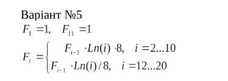
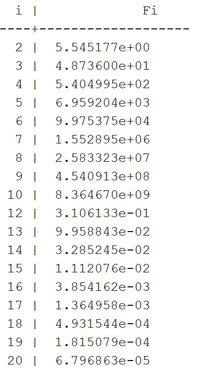
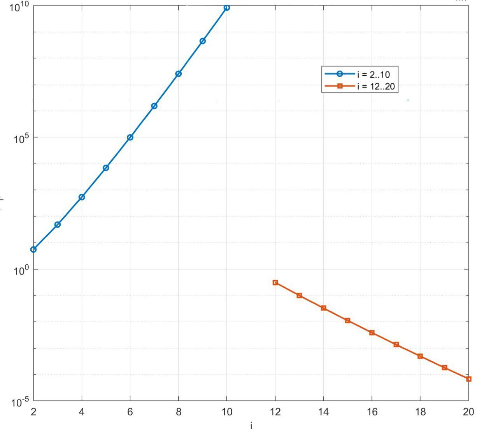

<p align="center"><b>МОНУ НТУУ КПІ ім. Ігоря Сікорського ФПМ СПіСКС</b></p>
<p align="center">
<b>Звіт з розрахунково-графічної роботи</b>
<br/><br/>
з дисципліни <br/> "Вступ до функціонального програмування"
</p>
<p align="right"><b>Студентка</b>: Романченко Вікторія Олександрівна КВ-22</p>
<p align="right"><b>Рік</b>: 2025</p>

## Загальне завдання

    1. Реалізувати програму для обчислення функції згідно варіанту мовою Common Lisp
    2. Виконати тестування реалізованої програми
    3. Порівняти результати роботи програми мовою Common Lisp з розрахунками іншими засобами

## Варіант завдання №5

<p align="center">
  
</p>

## Лістинг реалізації обчислення функції

```lisp
(defun fi (i)
  (labels ((f (k)
             (cond ((= k 1) 1d0)
                   ((= k 11) 1d0)
                   ((and (>= k 2) (<= k 10)) (* (f (1- k)) (* (log k) 8d0)))
                   ((and (>= k 12) (<= k 20)) (* (f (1- k)) (/ (log k) 8d0)))
                   (t (error "i out of range: ~A" k)))))
    (f i)))
```

### Тестові набори та утиліти

```lisp
(defun build-table ()
  (append
   (loop for i from 2 to 10 collect (list i (fi i)))
   (loop for i from 12 to 20 collect (list i (fi i)))))

(defun show-table ()
  (format t "~%  i | Fi(i)~%--------------------~%")
  (dolist (row (build-table))
    (format t "~3D | ~,8,2E~%" (first row) (second row))))

(defun run-tests ()
  (format t "~%Tests:~%")
  (format t "F1 = 1: ~A~%" (= (fi 1) 1d0))
  (format t "F11 = 1: ~A~%" (= (fi 11) 1d0))

  (let ((up    (loop for i from 2 to 10 collect (fi i)))
        (down  (loop for i from 12 to 20 collect (fi i))))
    (format t "2..10 increasing: ~A~%"
            (every #'< up (rest up)))
    (format t "12..20 decreasing: ~A~%"
            (every #'> down (rest down)))))
```

### Тестування

```lisp
CL-USER> (show-table)

  i | Fi(i)
--------------------
  2 | 5.54517746d+00
  3 | 4.87360017d+01
  4 | 5.40499556d+02
  5 | 6.95920395d+03
  6 | 9.97537578d+04
  7 | 1.55289475d+06
  8 | 2.58332310d+07
  9 | 4.54091288d+08
 10 | 8.36467077d+09
 12 | 3.10613334d-01
 13 | 9.95884308d-02
 14 | 3.28524481d-02
 15 | 1.11207600d-02
 16 | 3.85416175d-03
 17 | 1.36495780d-03
 18 | 4.93154443d-04
 19 | 1.81507893d-04
 20 | 6.79686323d-05
NIL
CL-USER> (run-tests)

Tests:
F1 = 1: T
F11 = 1: T
2..10 increasing: T
12..20 decreasing: T
NIL
```

### Порівняння результатів з іншими методами (Matlab)

<p align="center">
  
  <br>Таблиця
</p>

<p align="center">
  
  <br>Графік
</p>
